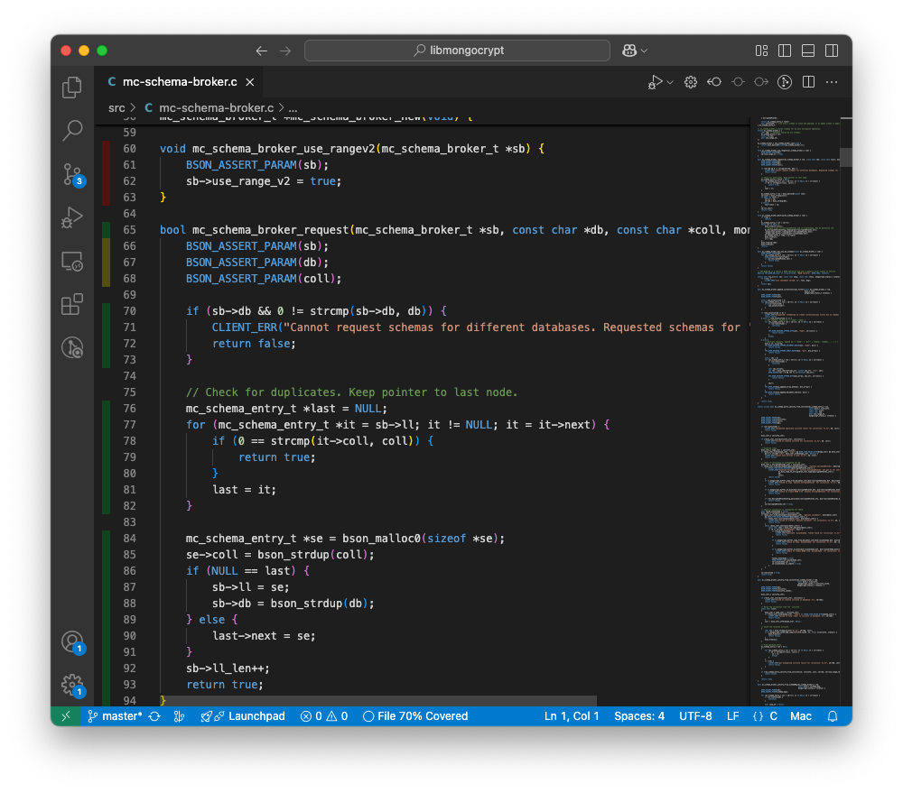

The following shows an example of using VS Code to display code coverage for libmongocrypt.

Install [Coverage Gutters](https://marketplace.visualstudio.com/items?itemName=ryanluker.vscode-coverage-gutters).

Configure `clang` with coverage flags:

```bash
LLVM_DIR=/opt/homebrew/opt/llvm/bin
cmake \
    -DCMAKE_C_COMPILER="$LLVM_DIR/clang" \
    -DCMAKE_BUILD_TYPE=Debug \
    -DCMAKE_C_FLAGS="-fprofile-instr-generate -fcoverage-mapping" \
    -Bcmake-build
```

Build:
```bash
cmake --build cmake-build --target test-mongocrypt
```

Run tests:
```bash
./cmake-build/test-mongocrypt "test_mc_schema*"
```
Running produces profiling data in `default.profdata`.

Generate an `lcov.info` file:

```bash
$LLVM_DIR/llvm-profdata merge -sparse default.profraw -o default.profdata
$LLVM_DIR/llvm-cov export -object ./cmake-build/test-mongocrypt -instr-profile=default.profdata -format lcov > lcov.info
```

Click "Watch" in the bottom bar of VS Code on the tested file to see coverage colors on the left side:


