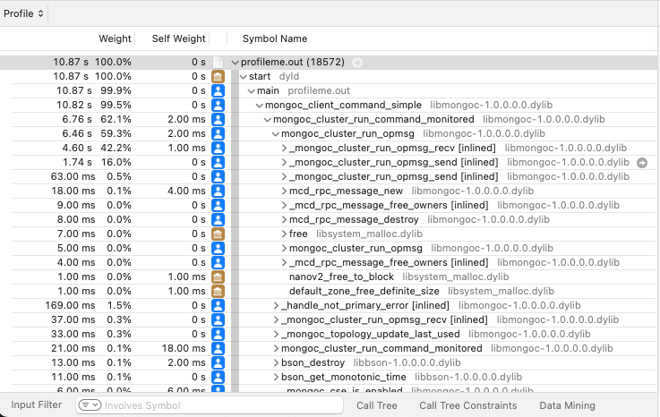

# Profile libmongoc with Instruments

This directory includes sample code to test profiling with macOS Instruments. Example:



## Instructions

Install XCode to get Instruments.

Install the C driver:

```bash
./install-mongo-c-driver.sh
```

Configure and build the test runner:
```bash
./configure.sh
./build.sh
```

Use Instruments to do a `Time Profile`. See the video: [Profile libmongoc with Instruments](https://youtu.be/Yh4-g9fNc44).

