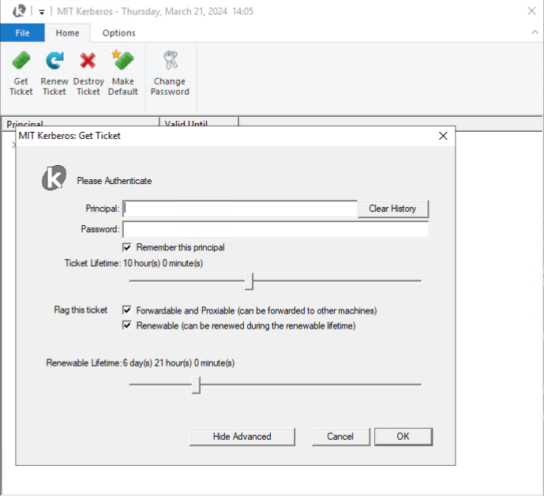

The MongoDB C driver supports using the Cyrus-SASL library to implement GSSAPI authentication. This is not the default (SSPI is the default).

At time of writing, the C driver does not test authenticating with Cyrus-SASL on Windows. The Cyrus-SASL library installed in Evergreen hosts does not appear to include the necessary GSSAPI plug-in. This motivates installing Cyrus-SASL from source.

# Install Cyrus-SASL and GSSAPI plug-in from source

Spawn a `windows-vsCurrent-xlarge` spawn host. Use Microsoft Remote Desktop to log in ([see instructions](https://wiki.corp.mongodb.com/display/~matt.kneiser/Connect+to+Windows+Virtual+Host+via+Remote+Desktop)).

Open "Developer Command Prompt for VS 2017". Clone fork of Cryus-SASL with the `2.1.28-mongo-c-driver` branch:

```
git clone https://github.com/kevinAlbs/cyrus-sasl --branch 2.1.28-mongo-c-driver C:\cyrus-sasl-source
```

The branch is based off of the 2.1.28 release tag and contains minor changes to VS project files to build with VS 2017, OpenSSL 1.1.1, and use paths on the Evergreen spawn host. See the commits on the branch for more information.

Install OpenSSL 1.1.1 with `choco`:
```bash
choco install openssl --version 1.1.1.2100
```

Install MIT Kerberos from https://web.mit.edu/kerberos/dist/index.html. Select "SDK" during the installer to include necessary header files.

Build libsasl2.dll:
```
cd C:\cyrus-sasl-source\win32
msbuild cyrus-sasl-core.sln /p:Platform=x64
```

Then build the GSSAPI plugin:
```
msbuild cyrus-sasl-gssapiv2.sln /p:Platform=x64
```

Then install to `C:\Cyrus-SASL`:
```
msbuild install.vcxproj /p:Platform=x64
```

# Test GSSAPI

To test GSSAPI with Cyrus, compile the C driver with `-DENABLE_SASL=CYRUS`. Run in the Cygwin shell:

```bash
cd /home/Administrator/mongo-c-driver
. "./.evergreen/scripts/find-cmake-latest.sh"
cmake_binary="$(find_cmake_latest)"
$cmake_binary -DENABLE_SASL=CYRUS \
    -DSASL2_ROOT_DIR="C:\\Cyrus-SASL\\x64" \
    -DCYRUS_PLUGIN_PATH_PREFIX='C:\\Cyrus-SASL'
    -Bcmake-build -S.
$cmake_binary --build cmake-build --target mongoc-ping
```

Dependency Walker can be used to confirm mongoc-1.0.dll links to libsasl.dll.

Get the values of `auth_gssapi` and `auth_host` from [AWS Secrets Manager](https://wiki.corp.mongodb.com/display/DRIVERS/Using+AWS+Secrets+Manager+to+Store+Testing+Secrets) in `drivers/c-driver`.

Open the MIT Kerberos Ticket Manager GUI. Click "Get Ticket" and enter the host and password from `auth_gssapi` (enter the URL encoded `%40` as `@`). Click "OK" to get a ticket:



Run `mongoc-ping`:

```bash
# Add path to bson-1.0.dll:
export PATH
PATH="$(pwd)/cmake-build/src/libbson/Debug:${PATH}"
# Ensure .dlls are executable:
chmod -f +x cmake-build/src/libmongoc/Debug/* || true
chmod -f +x cmake-build/src/libbson/Debug/* || true
# Add Cyrus and Kerberos dlls to path:
PATH="/cygdrive/c/Cyrus-SASL/x64/bin/:${PATH}"
PATH="/cygdrive/c/Program Files/MIT/Kerberos/bin/:${PATH}"
export MONGOC_SASL_PLUGIN_PREFIX="C:\\"
# Add path to plugin to registry:
reg add "HKEY_LOCAL_MACHINE\\SOFTWARE\\Carnegie Mellon\\Project Cyrus\\SASL Library" /v SearchPath /t REG_SZ /d "C:\\Cyrus-SASL\\x64\\plugins\\sasl" /f
ping=./cmake-build/src/libmongoc/Debug/mongoc-ping.exe
# Get values of `auth_gssapi` and `auth_host`
${ping} "mongodb://${auth_gssapi:?}@${auth_host}/?authMechanism=GSSAPI"
```

Expect this output:
```
{ "ok" : { "$numberDouble" : "1.0" } }
```
