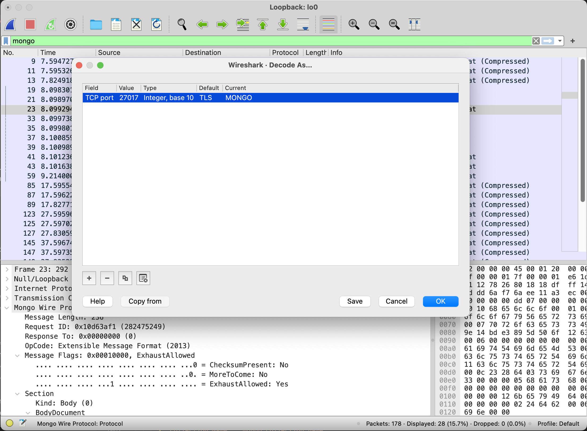
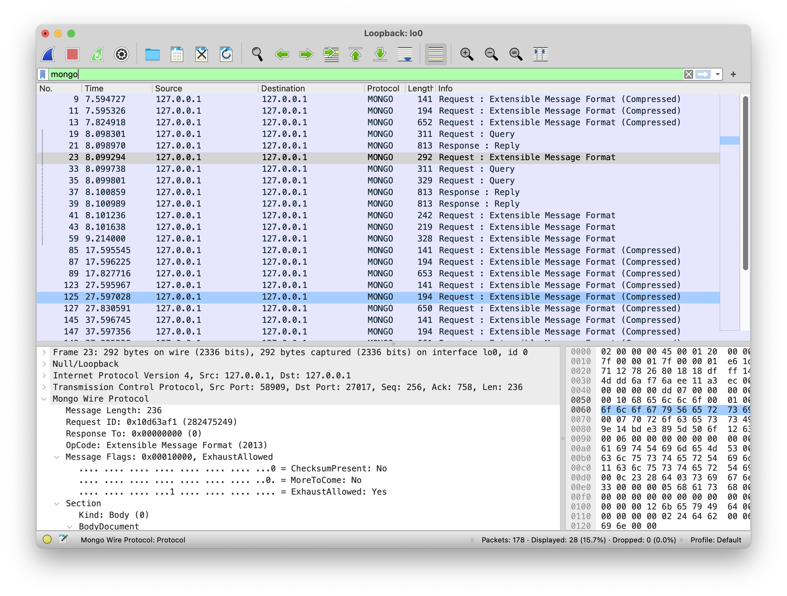
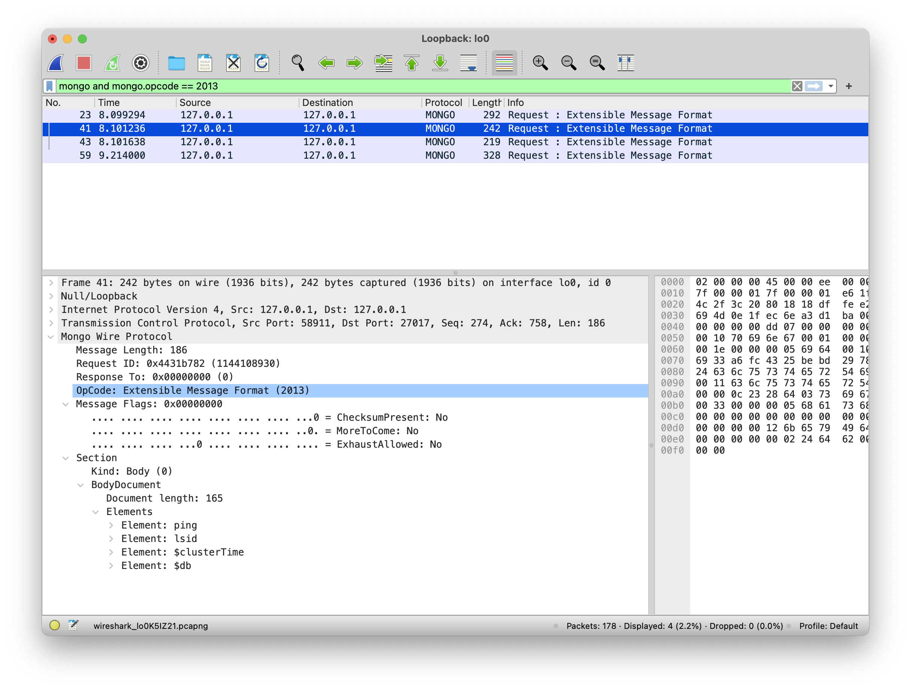

This video shows how to capture and decode the MongoDB wire protocol with Wireshark:
https://www.youtube.com/watch?v=BS28MRHoBq0

This requires telling Wireshark to dissect packets with the MONGO dissector. Go to "Analyze" => "Decode As". Add a rule to matching the TCP port of the server to MONGO. Example:

Use the `mongo` display filter to limit results to the `MONGO` protocol:

More display filters can be used to refine the results. For example, the `mongo.opcode` filter can be used to limit results to a specific opcode. Here is an example of limiting results to the `OP_MSG` wire protocol:

The `2013` opcode is for `OP_MSG`. The other opcodes are documented in [MongoDB Wire Protocol](https://www.mongodb.com/docs/manual/reference/mongodb-wire-protocol/#opcodes).